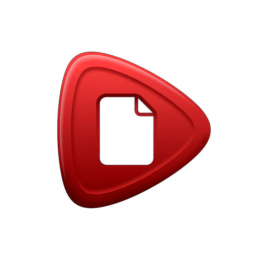

<div align="center">



# FileTube

**Broadcast yourself — your files.** A lightweight, self-hosted media server with a nostalgic, classic-YouTube interface (circa 2005–2010).

[](https://github.com/dtammam/filetube/actions/workflows/ci.yml)
[](https://github.com/dtammam/filetube/actions/workflows/docker-publish.yml)
[](https://hub.docker.com/r/deantammam/filetube)
[](https://hub.docker.com/r/deantammam/filetube)
[](LICENSE)

</div>

FileTube is a personal media application that lets you consume your local video and audio files in a web browser using a nostalgic, classic YouTube interface. It runs on your own server or local network, so your data stays with you.

## Features

- **Nostalgic YouTube layout** — Classic grid, uploader channels, star ratings, and mock comments.
- **YouTube-style player with custom blocky controls** — Theme-aware, app-owned playback controls (not the browser's native bar) for both video and audio; plays inline on iOS (no forced fullscreen), with ±15s skip (on-player buttons or double-tap), YouTube-style keyboard shortcuts on desktop (← / → ±5s, J/L ±10s, K/Space, 0–9 jump, ↑/↓ + scroll-wheel volume, M, C, < / >, F, Shift+N/P), press-and-hold for 2×, an adjustable playback-speed control (1×–2×), a loop/repeat toggle, and a full-screen view for both video and audio.
- **Docked mini-player + continuous browsing** — Keep watching while you browse: the player docks to a corner instead of stopping when you navigate away, with prev/next controls and an optional autoplay-next setting. Video also has a one-tap theatre mode, native Picture-in-Picture, and keeps playing across browser tabs on desktop.
- **Smart resume playback** — Automatically saves your progress and prompts you to resume where you left off.
- **Auto-generated thumbnails** — Uses FFmpeg to extract video frames or audio cover art automatically.
- **Audio file support** — Plays audio formats (MP3, FLAC, M4A, etc.) with embedded cover art shown behind the custom player controls.
- **iOS-first playability** — Browser-incompatible containers and codecs (AVI, HEVC/VP9/AV1, AC-3, etc.) are transcoded on demand to H.264/AAC MP4, so files that wouldn't otherwise play on iPhone/iPad just work.
- **Download to your device** — Save a copy of the original file straight from the watch page or any library card.
- **Quick, deliberate delete** — A two-tap trash-can right on each library card, plus a confirm step on the watch page, so nothing disappears from a single accidental tap.
- **Optional YouTube subscriptions (yt-dlp)** — Off by default. A subscriptions-first page lists your channels for quick browsing and management, with per-subscription audio/video + quality + filetype + "download last N" + max-length + skip-Shorts controls, one-shot URL downloads, and a persistent status chip with retry for anything that fails. Pin your favorite channels for one-tap access (in the desktop sidebar or the mobile Playlists sheet), or subscribe to a creator right from a downloaded video's watch page — even on videos you downloaded before subscribing — and view any channel's downloads as its own playlist.
- **PWA install** — Add FileTube to your phone or desktop home screen like a native app.
- **Era themes + icon sets** — Skin the UI as classic 2005, 2009, 2014, or 2021 YouTube, each with a matching icon style (or let it follow the era automatically), on top of a light/dark mode toggle.
- **Configurable transcode cache** — Point the on-demand transcode cache at its own directory, tune quality (CRF), and cap its size so it never grows unbounded.
- **Auto-scan with safe pruning** — The library rescans on a configurable interval and safely removes entries for files that were actually deleted (never for an unmounted share).
- **Self-hosted with Docker** — Start instantly with a single `docker compose up -d`.

## Screenshots

<p align="center">
  
</p>

<p align="center">
  
  &nbsp;
  
  &nbsp;
  
</p>

## Quick Start (Docker)

You'll need **Docker** and **Docker Compose** installed.

### 1. Download the project

```bash
git clone https://github.com/dtammam/filetube.git
cd filetube
```

### 2. Set up your environment file

```bash
cp .env.example .env
```

Open `.env` and configure your variables:

| Variable | What to put | Why |
|----------|------------|-----|
| `FILETUBE_IMAGE_TAG` | `latest` or a specific version | Pulls the corresponding container image |
| `SERVER_HOST_PORT` | Port number (e.g. `3000`) | Port on your network to access the web app |
| `DATA_DIR` | Host folder path (e.g. `./data`) | Where the database (`db.json`) and thumbnails are saved |

### 3. Mount your media folders

Open `docker-compose.yml` and add your video or audio folders under `volumes`:

```yaml
    volumes:
      - ./data:/app/data
      - /path/to/your/movies:/media/movies
      - /path/to/your/music:/media/music
```

### 4. Start it up

```bash
docker compose pull
docker compose up -d
```

### 5. Open the app

Navigate to [http://localhost:3000](http://localhost:3000) (or the port you configured in `.env`).

Open the **Settings** gear icon in the top right, add your container paths (e.g. `/media/movies`), and click **Save & Scan Library**.

### Automation & Storage

The **Settings → Automation & Storage** box controls the two things the
server does in the background:

- **Scan interval** — Off (manual only) / 30m / 1h / 6h / 12h / 24h, **default
  30 minutes**. A "Scan now" button and a "Last scanned: N ago" line are also
  here. Only one scan (automatic or manual) ever runs at a time.
- **Remove entries for deleted files during scan** — on by default. When a
  file that was previously scanned is no longer on disk, its library entry
  (and thumbnail/transcode) is removed on the next scan. This is guarded: if
  an entire configured folder is missing (e.g. an unmounted network share),
  FileTube treats that as a mount problem, not a deletion, and never prunes
  entries under it — regardless of this toggle.
- **Transcode cache** — a live size display, a "Clear cache now" button, an
  age-retention setting (Off / 7 / 14 / 30 / 90 days, **default 30**) that
  removes cached transcoded MP4s not watched within the window, and a
  size-cap field. The age-retention sweep and the size cap both run
  independently; the size cap is the hard backstop regardless of the age
  setting.

The transcode cache's size cap can also be set via the `TRANSCODE_CACHE_MAX_BYTES`
environment variable. Precedence: the UI cap, when set, wins; leaving the UI
field blank defers to `TRANSCODE_CACHE_MAX_BYTES` if set, or a 5 GB built-in
default otherwise. Existing deployments that only set the env var keep working
unchanged.

Two more transcode-related environment variables (both optional, both default
to today's behavior with no config changes needed):

| Variable | Default | What it does |
|----------|---------|---------------|
| `TRANSCODE_DIR` | `<DATA_DIR>/transcoded` | Where the on-demand transcoded MP4 cache is written. Point it at a different disk/mount if you want the cache off your main data volume (e.g. faster local storage, or a large external/NFS share). The directory is created on boot if missing; the existing size-cap eviction and age-retention sweep both key off this same directory. |
| `TRANSCODE_CRF` | `23` | The x264 CRF (quality) used for both on-demand transcode paths (cached and live). Lower = higher quality/larger files, higher = smaller files/lower quality. Valid range is `1`-`51`; anything unset/invalid/out of range falls back to `23` (a warning is logged, the server never crashes). Opt-in only — the default is unchanged. |

### Staying up to date (or pinning a version)

Set `FILETUBE_IMAGE_TAG` in your `.env` to choose how you track updates:

| Tag | Behavior |
|-----|----------|
| `latest` | Newest **release** (recommended for most people) |
| `1.4.2` | Pinned to an exact version — never moves |
| `1.4` / `1` | Latest patch / minor within that line |
| `edge` | Newest `main` commit (bleeding edge) |

After changing the tag (or when a new release ships), pull and restart:

```bash
docker compose pull
docker compose up -d
```

Prefer automatic updates? Point a tool like [Watchtower](https://containrrr.dev/watchtower/)
at the `latest` tag. See [docs/RELEASING.md](docs/RELEASING.md) for the full tag scheme.

---

## Optional: YouTube subscriptions (yt-dlp)

FileTube can optionally subscribe to YouTube channels and periodically
download their new videos into a media folder that the normal library scanner
already indexes — the downloaded videos then show up in the regular FileTube
UI like any other file, with no separate player or catalog. Deleting one in
FileTube removes it from disk (and it stays deleted; the next poll will not
re-download it).

This feature is **off by default and fully additive**. When disabled (the
default), it is a clean no-op: no extra routes, no nav link, no background
polling, and no assumption that `yt-dlp` is even installed. Existing
installs are completely unaffected unless you opt in.

### Enabling it

Set `FILETUBE_YTDLP_ENABLED=true` in your `.env` (or the container's
environment) and restart. The Docker image already bundles a pinned
`yt-dlp`, so no extra setup is required — a **Subscriptions** link appears
in the UI once enabled.

| Variable | Default | What it does |
|----------|---------|---------------|
| `FILETUBE_YTDLP_ENABLED` | off | Master switch. Only `true`, `1`, or `yes` enable the feature; anything else (including unset) stays disabled. |
| `FILETUBE_YTDLP_COOKIES_FILE` | unset | Path (inside the container) to a mounted `cookies.txt`, used for members-only or age-gated videos. Unset = no cookies. |
| `FILETUBE_YTDLP_POLL_MINUTES` | `60` | How often, in minutes, FileTube checks subscriptions for new videos. `0` = manual re-pull only (no background poll). |
| `FILETUBE_YTDLP_DOWNLOAD_DIR` | `<DATA_DIR>/ytdlp-downloads` | Where downloaded videos are saved. |
| `FILETUBE_YTDLP_VERSION` | (build-time) | Informational only — reflects the `yt-dlp` version pinned into the image. Does not trigger or change an install. The subscriptions page footer shows the probed binary version with a staleness note past 90 days. To update yt-dlp: bump the `YTDLP_VERSION` ARG in the Dockerfile and rebuild the image (locked decision D5 — there is no runtime auto-update). |
| `FILETUBE_YTDLP_MAX_VIDEOS` | `25` | Caps each channel's listing to its newest N videos, so a fresh subscribe (or any re-pull) never attempts a channel's entire back-catalog. `0` = unlimited (consider the whole channel). |
| `FILETUBE_YTDLP_MAX_DURATION_SECONDS` | `7200` | Skips videos longer than this many seconds (default 2h), so very long items and live streams aren't auto-downloaded. Each subscription can override it on the Subscriptions page. `0` = no length limit. (Videos with an unknown length are skipped, so a capped subscription never accidentally records an unbounded live stream.) |
| `FILETUBE_YTDLP_DOWNLOAD_TIMEOUT_MINUTES` | `180` | Ceiling (minutes) for a single download before it's killed and treated as a failure. Raise this if you download very large/multi-gigabyte videos on a slow connection. Must be an integer from `1` to `1440`; anything else falls back to the default. |
| `FILETUBE_YTDLP_SLEEP_REQUESTS` | `1` | Seconds to sleep between metadata requests (`--sleep-requests`), applied to both the channel listing pass and downloads. Helps avoid bot-checks/429s. Must be an integer from `0` to `60`; anything else falls back to the default. |
| `FILETUBE_YTDLP_SLEEP_INTERVAL` | `2` | Minimum seconds to sleep before each download (`--sleep-interval`). Must be an integer from `0` to `60`; anything else falls back to the default. |
| `FILETUBE_YTDLP_MAX_SLEEP_INTERVAL` | `5` | Maximum seconds to sleep before each download (`--max-sleep-interval`), randomized between `FILETUBE_YTDLP_SLEEP_INTERVAL` and this value. Must be an integer from `0` to `60`; anything else falls back to the default. Always clamped to be at least `FILETUBE_YTDLP_SLEEP_INTERVAL`. |
| `FILETUBE_YTDLP_RETRIES` | `5` | Number of times yt-dlp retries a failed download/fragment (`--retries`) before giving up. Must be an integer from `0` to `20`; anything else falls back to the default. |
| `FILETUBE_YTDLP_PLAYER_CLIENT` | unset | Advanced: forces a specific YouTube player client (`--extractor-args youtube:player_client=<value>`), e.g. `web` or `android,web`. Unset by default — yt-dlp picks its own client(s). Only lowercase letters, digits, `_`, `,`, and `-` are accepted; anything else (or unset) means no flag is emitted. |
| `FILETUBE_YTDLP_SOCKET_TIMEOUT_SECONDS` | `15` | Per-request socket timeout passed to yt-dlp (`--socket-timeout`). Under bot-detection YouTube hangs connections rather than erroring; this converts dead sockets into fast, retryable failures. Integer from `5` to `120`; anything else falls back to the default. |
| `FILETUBE_YTDLP_LIST_TIMEOUT_MINUTES` | `5` | Base budget for a channel's metadata LIST pass. The effective budget additionally scales with `LIST_SCAN_CAP` × `SLEEP_REQUESTS` (the pacing a cap-bounded listing can legitimately need), capped at 60 minutes. Integer from `1` to `60`. |
| `FILETUBE_YTDLP_LIST_SCAN_CAP` | `200` | Hard cap on how many playlist entries a LIST pass may enumerate (`--playlist-end`) — the wall-clock backstop behind the break-early filter that stops listing at the first pre-cutoff video. `0` disables the cap. Integer from `0` to `10000`. |
| `FILETUBE_YTDLP_STALL_MINUTES` | `10` | Stall watchdog: a download producing NO output for this many minutes is killed with a specific "stalled" reason (instead of waiting out the full download timeout while blocking the queue). `0` disables the watchdog. Integer from `0` to `120`. |
| `FILETUBE_YTDLP_BREAKER_FAILURES` | `4` | Circuit breaker: after this many CONSECUTIVE channel failures in one poll run, the rest of the run is aborted and retried later with backoff (stops a throttled session from cascading across every remaining channel). `0` disables the breaker. Integer from `0` to `50`. |
| `FILETUBE_YTDLP_BREAKER_BACKOFF_MINUTES` | `30` | How long a tripped circuit breaker waits before automatically retrying the poll. Integer from `1` to `1440`. |

**Recommendation:** point `FILETUBE_YTDLP_DOWNLOAD_DIR` at a dedicated
directory — not an existing mapped library folder, and not an ancestor
directory of one.

### Text-to-speech: "Listen from Here" (v1.38, works out of the box)

Read your EPUB books aloud from the paragraph you're on — playback continues on
the lock screen with the book cover as artwork. Synthesis runs one chapter at a
time and automatically **defers while a subscription download is in progress** so
the two never spike your CPU/disk together.

**Works out of the box:** the Docker image bakes in **espeak-ng**, so the
reader's **Listen** button lights up with no configuration. espeak-ng is tiny and
robotic — a clear, functional narrator, not a natural voice.

**Upgrade to a natural voice (opt-in):** point FileTube at
[Piper](https://github.com/OHF-Voice/piper1-gpl) — a much more human-sounding
engine — by providing its binary + a `.onnx` voice model and switching the
engine. Piper isn't bundled (its `onnxruntime` dependency has no musl/Alpine
wheels and would add ~300 MB to the image), so it's opt-in for those who want
the better voice. FFmpeg (already in the image) encodes the audio for both
engines.

| Variable | Default | Purpose |
|---|---|---|
| `FILETUBE_TTS_ENGINE` | `espeak-ng` *(image)* / `piper` *(code)* | Which engine to use: `piper` or `espeak-ng`. The Docker image defaults to the bundled `espeak-ng`; set `piper` (with a model below) to upgrade. |
| `FILETUBE_TTS_PIPER_BIN` | `piper` | Path to the `piper` binary (PATH-resolved by default). |
| `FILETUBE_TTS_PIPER_MODEL` | unset | Path (inside the container) to a Piper `.onnx` voice model. **Required** for Piper to activate. |
| `FILETUBE_TTS_PIPER_CONFIG` | `<model>.json` | Path to the model's config JSON. Defaults to piper's own `<model>.onnx.json` convention. |
| `FILETUBE_TTS_ESPEAK_BIN` | `espeak-ng` | Path to the `espeak-ng` binary (PATH-resolved; bundled in the image). |
| `FILETUBE_TTS_ESPEAK_VOICE` | `en` | espeak-ng voice id. |

> **Upgrading from v1.38.0?** If you already had Piper working by mounting a
> model and setting **only** `FILETUBE_TTS_PIPER_MODEL` (relying on the old
> `piper` default), add `-e FILETUBE_TTS_ENGINE=piper` — the image now defaults
> to the bundled `espeak-ng`, so without that flag your Piper model is ignored
> and you'd hear the robotic voice instead.

Synthesized chapter audio is cached under `<DATA_DIR>/tts-cache/`. There is no
automatic size/age eviction yet (it's cleared by "Clear cache now" in Settings
and when a book is removed) — a known limitation for very large libraries.

### Members-only / age-gated content

Members-only and age-gated videos require cookies from a logged-in YouTube
session. To support these:

1. Export a `cookies.txt` from a signed-in browser session (e.g. with a
   cookies-export extension) and mount it into the container, read-only:

   ```yaml
   volumes:
     - /path/to/your/cookies.txt:/app/data/cookies.txt:ro
   ```

2. Set `FILETUBE_YTDLP_COOKIES_FILE=/app/data/cookies.txt` to point at it.
3. Turn on the **"Allow members-only content"** toggle on the Subscriptions
   page.

Members-only videos are only ever downloaded when **both** the toggle is on
**and** a cookies file is configured — either one missing means they're
skipped. This is fail-safe by design: an unconfigured or misconfigured
cookies file simply results in members-only videos being skipped, never a
crash or a silent bypass.

### Deduplication depends on a persistent download directory

The "deleted stays gone" guarantee above (and dedup in general — a channel
re-poll never re-downloading a video it already has) relies on a single
module-owned file, `.ytdlp-archive.txt`, stored directly inside
`FILETUBE_YTDLP_DOWNLOAD_DIR`. Every completed download records its id there,
and every poll checks it before downloading anything.

That file has to actually persist for the guarantee to hold. If
`FILETUBE_YTDLP_DOWNLOAD_DIR` points at a network share (SMB/NFS/etc.) and
the share is unmounted or unreachable at poll time, or if the download
directory is wiped for any other reason, dedup state is lost — the next poll
has no record of what was already fetched and will re-download each
subscribed channel's videos, up to its `FILETUBE_YTDLP_MAX_VIDEOS` window.
**Recommendation:** keep the download directory (and the archive file inside
it) on storage that is always mounted and reliably persistent, the same way
you'd treat `DATA_DIR`.

### Keeping yt-dlp up to date

The bundled `yt-dlp` binary is **pinned inside the Docker image** at build
time — there is no runtime or in-app auto-update. To pick up a newer
`yt-dlp` release, pull or rebuild a newer FileTube image (see
[Staying up to date](#staying-up-to-date-or-pinning-a-version), above).

---

## Local Development (Without Docker)

### Prerequisites
- Node.js (v20+; the Docker image ships Node 22 LTS)
- FFmpeg installed and in your system PATH (optional, but required for video thumbnails).

### Run steps
```bash
npm install
npm start
```

By default the server starts on port 3000. Override it with `PORT=3001 npm start`.

## Roadmap

Planned improvements are tracked in [ROADMAP.md](ROADMAP.md).

## License

[MIT](LICENSE) © Dean Tammam
