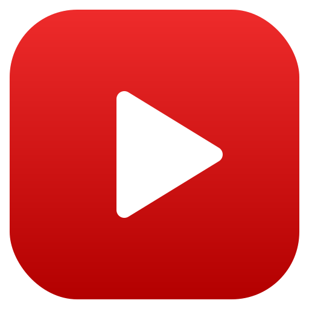
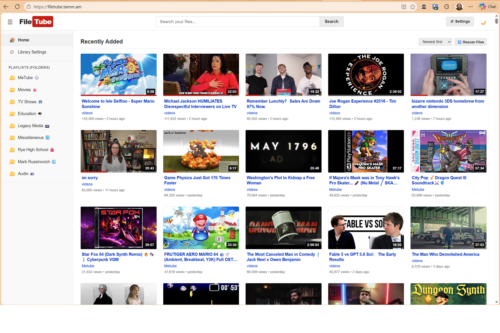
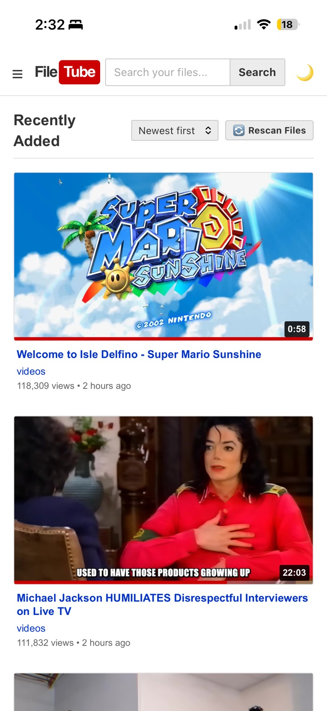
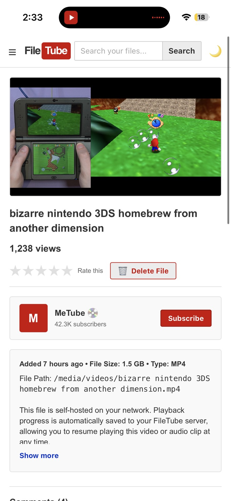
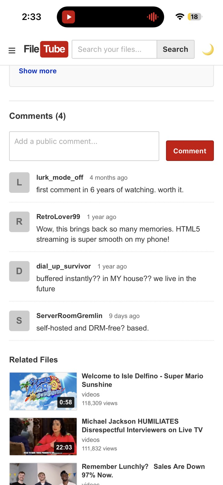

<div align="center">



# FileTube

**Broadcast yourself — your files.** A lightweight, self-hosted media server with a nostalgic, classic-YouTube interface (circa 2005–2010).

[](https://github.com/dtammam/filetube/actions/workflows/ci.yml)
[](https://github.com/dtammam/filetube/actions/workflows/docker-publish.yml)
[](https://hub.docker.com/r/deantammam/filetube)
[](https://hub.docker.com/r/deantammam/filetube)
[](LICENSE)

</div>

FileTube is a personal media application that lets you consume your local video and audio files in a web browser using a nostalgic, classic YouTube interface. It runs on your own server or local network, so your data stays with you.

## Features

- **Nostalgic YouTube layout** — Classic grid, uploader channels, star ratings, and mock comments.
- **YouTube-style player** — Plays inline on iOS (no forced fullscreen), with ±15s skip via on-player buttons, double-tap, or the ← / → keys.
- **Smart resume playback** — Automatically saves your progress and prompts you to resume where you left off.
- **Auto-generated thumbnails** — Uses FFmpeg to extract video frames or audio cover art automatically.
- **Audio file support** — Plays audio formats (MP3, FLAC, M4A, etc.) showing embedded cover art with native controls.
- **Permanent file deletion** — Delete unwanted media directly from the browser to free up server space.
- **Dark mode** — Easy toggle between classic light and sleek dark mode.
- **Self-hosted with Docker** — Start instantly with a single `docker compose up -d`.

## Screenshots

<p align="center">
  
</p>

<p align="center">
  
  &nbsp;
  
  &nbsp;
  
</p>

## Quick Start (Docker)

You'll need **Docker** and **Docker Compose** installed.

### 1. Download the project

```bash
git clone https://github.com/dtammam/filetube.git
cd filetube
```

### 2. Set up your environment file

```bash
cp .env.example .env
```

Open `.env` and configure your variables:

| Variable | What to put | Why |
|----------|------------|-----|
| `FILETUBE_IMAGE_TAG` | `latest` or a specific version | Pulls the corresponding container image |
| `SERVER_HOST_PORT` | Port number (e.g. `3000`) | Port on your network to access the web app |
| `DATA_DIR` | Host folder path (e.g. `./data`) | Where the database (`db.json`) and thumbnails are saved |

### 3. Mount your media folders

Open `docker-compose.yml` and add your video or audio folders under `volumes`:

```yaml
    volumes:
      - ./data:/app/data
      - /path/to/your/movies:/media/movies
      - /path/to/your/music:/media/music
```

### 4. Start it up

```bash
docker compose pull
docker compose up -d
```

### 5. Open the app

Navigate to [http://localhost:3000](http://localhost:3000) (or the port you configured in `.env`).

Open the **Settings** gear icon in the top right, add your container paths (e.g. `/media/movies`), and click **Save & Scan Library**.

### Automation & Storage

The **Settings → Automation & Storage** box controls the two things the
server does in the background:

- **Scan interval** — Off (manual only) / 30m / 1h / 6h / 12h / 24h, **default
  30 minutes**. A "Scan now" button and a "Last scanned: N ago" line are also
  here. Only one scan (automatic or manual) ever runs at a time.
- **Remove entries for deleted files during scan** — on by default. When a
  file that was previously scanned is no longer on disk, its library entry
  (and thumbnail/transcode) is removed on the next scan. This is guarded: if
  an entire configured folder is missing (e.g. an unmounted network share),
  FileTube treats that as a mount problem, not a deletion, and never prunes
  entries under it — regardless of this toggle.
- **Transcode cache** — a live size display, a "Clear cache now" button, an
  age-retention setting (Off / 7 / 14 / 30 / 90 days, **default 30**) that
  removes cached transcoded MP4s not watched within the window, and a
  size-cap field. The age-retention sweep and the size cap both run
  independently; the size cap is the hard backstop regardless of the age
  setting.

The transcode cache's size cap can also be set via the `TRANSCODE_CACHE_MAX_BYTES`
environment variable. Precedence: the UI cap, when set, wins; leaving the UI
field blank defers to `TRANSCODE_CACHE_MAX_BYTES` if set, or a 5 GB built-in
default otherwise. Existing deployments that only set the env var keep working
unchanged.

### Staying up to date (or pinning a version)

Set `FILETUBE_IMAGE_TAG` in your `.env` to choose how you track updates:

| Tag | Behavior |
|-----|----------|
| `latest` | Newest **release** (recommended for most people) |
| `1.4.2` | Pinned to an exact version — never moves |
| `1.4` / `1` | Latest patch / minor within that line |
| `edge` | Newest `main` commit (bleeding edge) |

After changing the tag (or when a new release ships), pull and restart:

```bash
docker compose pull
docker compose up -d
```

Prefer automatic updates? Point a tool like [Watchtower](https://containrrr.dev/watchtower/)
at the `latest` tag. See [docs/RELEASING.md](docs/RELEASING.md) for the full tag scheme.

---

## Optional: YouTube subscriptions (yt-dlp)

FileTube can optionally subscribe to YouTube channels and periodically
download their new videos into a media folder that the normal library scanner
already indexes — the downloaded videos then show up in the regular FileTube
UI like any other file, with no separate player or catalog. Deleting one in
FileTube removes it from disk (and it stays deleted; the next poll will not
re-download it).

This feature is **off by default and fully additive**. When disabled (the
default), it is a clean no-op: no extra routes, no nav link, no background
polling, and no assumption that `yt-dlp` is even installed. Existing
installs are completely unaffected unless you opt in.

### Enabling it

Set `FILETUBE_YTDLP_ENABLED=true` in your `.env` (or the container's
environment) and restart. The Docker image already bundles a pinned
`yt-dlp`, so no extra setup is required — a **Subscriptions** link appears
in the UI once enabled.

| Variable | Default | What it does |
|----------|---------|---------------|
| `FILETUBE_YTDLP_ENABLED` | off | Master switch. Only `true`, `1`, or `yes` enable the feature; anything else (including unset) stays disabled. |
| `FILETUBE_YTDLP_COOKIES_FILE` | unset | Path (inside the container) to a mounted `cookies.txt`, used for members-only or age-gated videos. Unset = no cookies. |
| `FILETUBE_YTDLP_POLL_MINUTES` | `60` | How often, in minutes, FileTube checks subscriptions for new videos. `0` = manual re-pull only (no background poll). |
| `FILETUBE_YTDLP_DOWNLOAD_DIR` | `<DATA_DIR>/ytdlp-downloads` | Where downloaded videos are saved. |
| `FILETUBE_YTDLP_VERSION` | (build-time) | Informational only — reflects the `yt-dlp` version pinned into the image. Does not trigger or change an install. |
| `FILETUBE_YTDLP_MAX_VIDEOS` | `25` | Caps each channel's listing to its newest N videos, so a fresh subscribe (or any re-pull) never attempts a channel's entire back-catalog. `0` = unlimited (consider the whole channel). |

### Members-only / age-gated content

Members-only and age-gated videos require cookies from a logged-in YouTube
session. To support these:

1. Export a `cookies.txt` from a signed-in browser session (e.g. with a
   cookies-export extension) and mount it into the container, read-only:

   ```yaml
   volumes:
     - /path/to/your/cookies.txt:/app/data/cookies.txt:ro
   ```

2. Set `FILETUBE_YTDLP_COOKIES_FILE=/app/data/cookies.txt` to point at it.
3. Turn on the **"Allow members-only content"** toggle on the Subscriptions
   page.

Members-only videos are only ever downloaded when **both** the toggle is on
**and** a cookies file is configured — either one missing means they're
skipped. This is fail-safe by design: an unconfigured or misconfigured
cookies file simply results in members-only videos being skipped, never a
crash or a silent bypass.

### Deduplication depends on a persistent download directory

The "deleted stays gone" guarantee above (and dedup in general — a channel
re-poll never re-downloading a video it already has) relies on a single
module-owned file, `.ytdlp-archive.txt`, stored directly inside
`FILETUBE_YTDLP_DOWNLOAD_DIR`. Every completed download records its id there,
and every poll checks it before downloading anything.

That file has to actually persist for the guarantee to hold. If
`FILETUBE_YTDLP_DOWNLOAD_DIR` points at a network share (SMB/NFS/etc.) and
the share is unmounted or unreachable at poll time, or if the download
directory is wiped for any other reason, dedup state is lost — the next poll
has no record of what was already fetched and will re-download each
subscribed channel's videos, up to its `FILETUBE_YTDLP_MAX_VIDEOS` window.
**Recommendation:** keep the download directory (and the archive file inside
it) on storage that is always mounted and reliably persistent, the same way
you'd treat `DATA_DIR`.

### Keeping yt-dlp up to date

The bundled `yt-dlp` binary is **pinned inside the Docker image** at build
time — there is no runtime or in-app auto-update. To pick up a newer
`yt-dlp` release, pull or rebuild a newer FileTube image (see
[Staying up to date](#staying-up-to-date-or-pinning-a-version), above).

---

## Local Development (Without Docker)

### Prerequisites
- Node.js (v20+; the Docker image ships Node 22 LTS)
- FFmpeg installed and in your system PATH (optional, but required for video thumbnails).

### Run steps
```bash
npm install
npm start
```

By default the server starts on port 3000. Override it with `PORT=3001 npm start`.

## Roadmap

Planned improvements are tracked in [ROADMAP.md](ROADMAP.md).

## License

[MIT](LICENSE) © Dean Tammam
