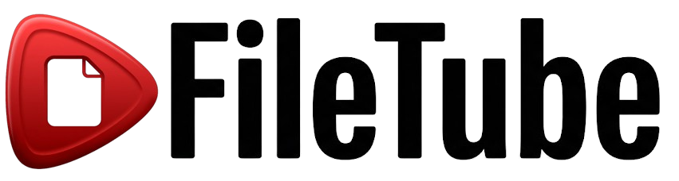
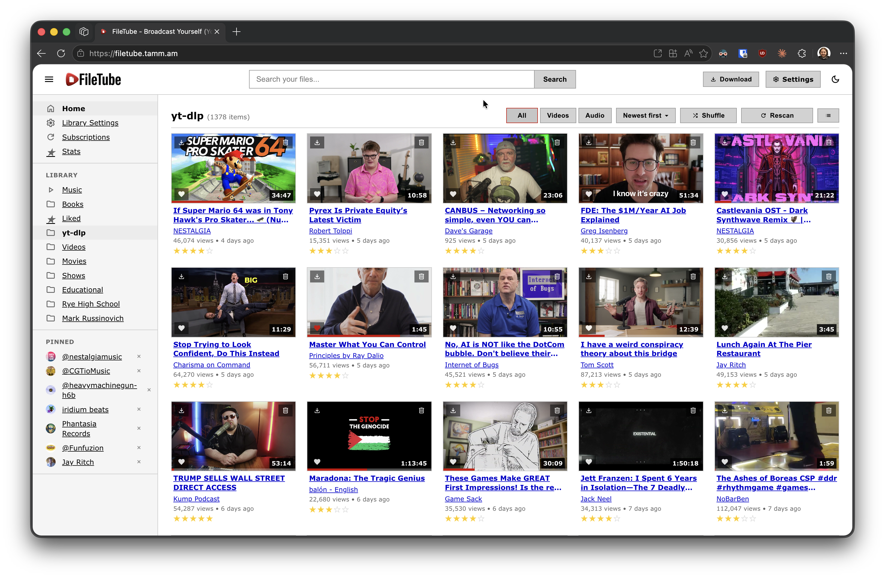
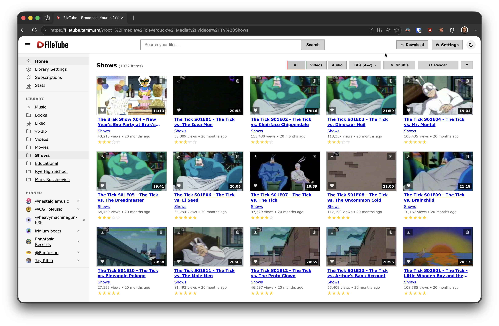
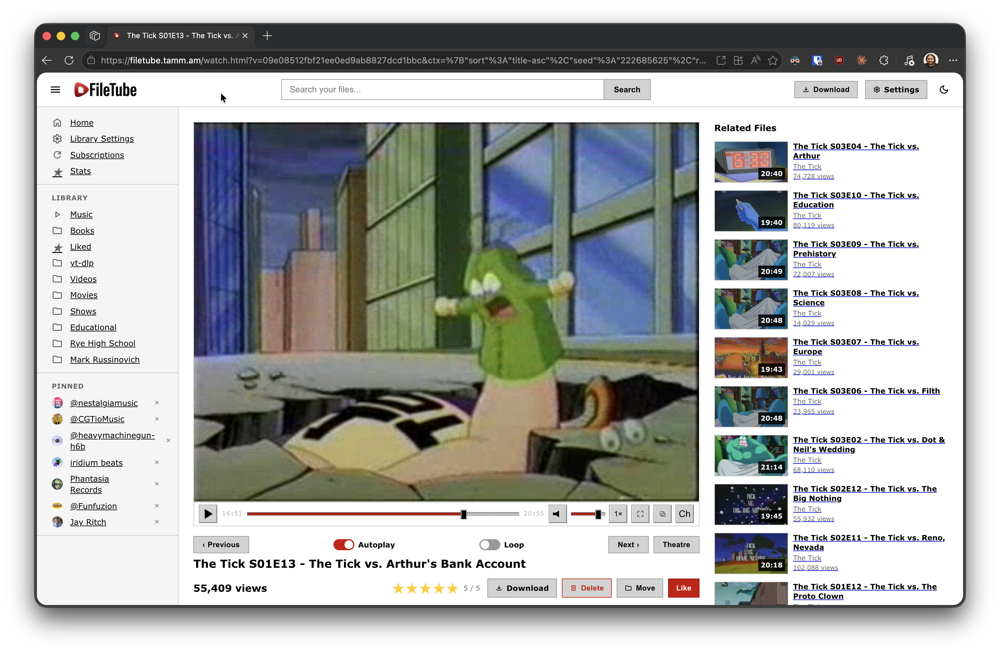
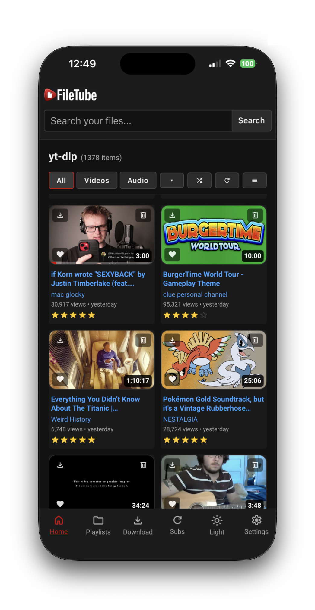
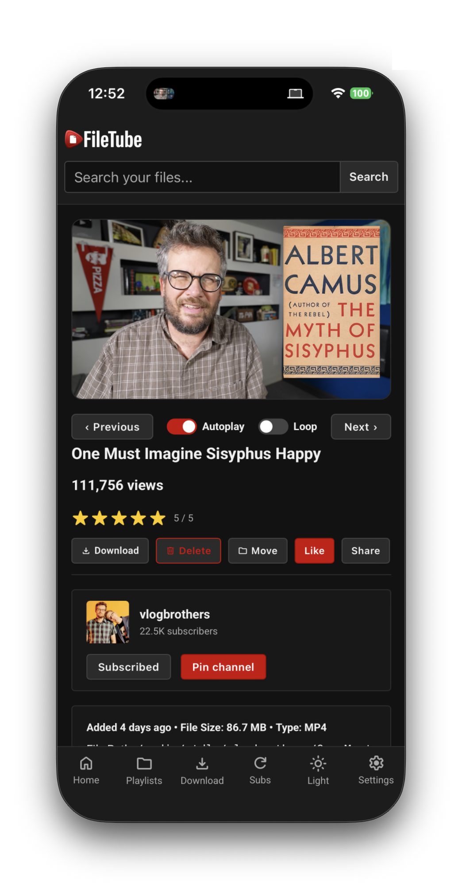
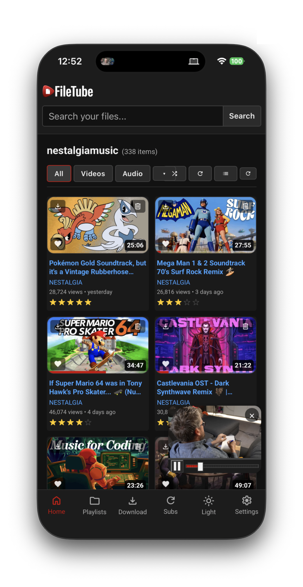
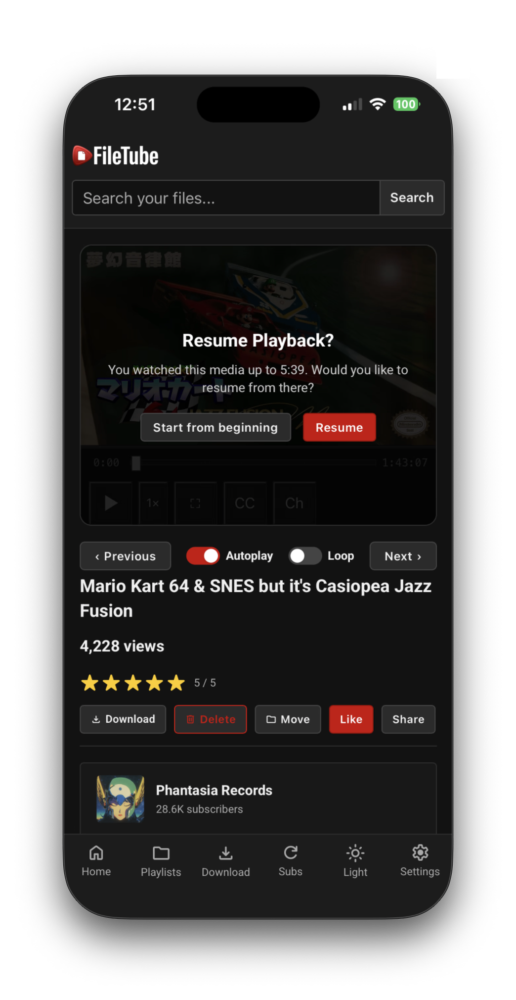

<div align="center">

<picture>
  <source media="(prefers-color-scheme: dark)" srcset="assets/images/filetube-banner-white.png">
  
</picture>

**Broadcast yourself - your files.**

A lightweight, self-hosted media server with a nostalgic, classic-YouTube interface.
Your videos, music, and books - on every screen in the house, and nowhere else.

[](https://github.com/dtammam/filetube/actions/workflows/ci.yml)
[](https://github.com/dtammam/filetube/actions/workflows/docker-publish.yml)
[](https://hub.docker.com/r/deantammam/filetube)
[](https://hub.docker.com/r/deantammam/filetube)
[](LICENSE)

[Quick Start](#quick-start-docker) · [Features](#features) · [Screenshots](#screenshots) · [Roku](#-on-your-tv-the-roku-channel) · [Configuration](docs/CONFIGURATION.md) · [Roadmap](ROADMAP.md)

</div>

---

FileTube scans your local media folders and serves them through a web app that
looks and feels like the YouTube you remember - pick your era (2005, 2009,
2014, or 2021), light or dark. It runs on your own server or LAN with a single
container, streams to desktop, phone (PWA), and Roku, and keeps watch
progress, likes, and reading positions per account, synced across devices.
Your library never leaves your network - the only outbound traffic is what
you explicitly opt into (yt-dlp channel downloads, podcast RSS fetches, and
Web Push notifications).

## Screenshots

**Old-era light theme on desktop:**

<p align="center">
  
</p>

<p align="center">
  
  &nbsp;
  
</p>

**Modern-era dark theme on mobile:**

<p align="center">
  
  &nbsp;
  
  &nbsp;
  
  &nbsp;
  
</p>

## Features

### Watch

- **Classic YouTube experience** - grid home, uploader channels, star ratings, mock comments, and four era themes (2005 / 2009 / 2014 / 2021) with matching icon sets, plus light/dark mode.
- **A real player, not a `<video>` tag** - app-owned blocky controls, keyboard shortcuts (J/K/L, 0–9, speed, loop, and more), press-and-hold 2×, chapters, and inline playback on iOS.
- **Keep browsing while you watch** - the player docks to a mini-player as you navigate; theatre mode, Picture-in-Picture, prev/next, and optional autoplay.
- **Smart resume, synced everywhere** - progress saves continuously and follows you across desktop, phone, and TV.
- **Plays what browsers won't** - AVI, HEVC, VP9, AC-3 and friends transcode on demand to H.264/AAC MP4, so everything plays on an iPhone too.

### Listen & read

- **First-class music library** - Albums / Artists / Songs / Liked with album art, shuffle, search and sort, and an art-forward phone-first now-playing view. ALAC transcodes on demand.
- **Books library + reader** - EPUB and PDF in the browser: paginated reader, table of contents, paper/sepia/night themes, per-account positions.
- **"Listen from Here" (TTS)** - have book chapters read aloud (lock-screen friendly); works out of the box, upgradeable to a natural [Piper](https://github.com/OHF-Voice/piper1-gpl) voice.
- **Podcasts, self-hosted** - subscribe to RSS feeds (private/paid feed URLs stay in a secrets file outside the database), auto-download new episodes for offline playback, with show art, per-user progress/played state, pins, and a recoverable trash - background playback and lock-screen controls included.

### Run your library

- **Multi-account** - an auth wall with per-user progress, likes, pins, and reading positions; admin user management; **per-user library access control** (block-list or a fail-closed allow-list for a kid-safe account - scoped across video, music, podcasts, and books, on both listings and direct file access); one-click app-state backup/restore (settings, accounts, watch state, library metadata - your media files themselves stay wherever you keep them and are not in the bundle).
- **Auto-scan with safe pruning** - rescans on an interval; removes entries only for files that are truly gone (an unmounted share is never treated as a deletion).
- **Auto thumbnails** - FFmpeg extracts video frames and audio cover art; caches are size-capped and age-swept.
- **Optional YouTube subscriptions (yt-dlp)** - off by default. Subscribe to channels, auto-download new videos into your library, with per-channel quality/length/Shorts controls and one-shot URL downloads. [Full guide →](docs/CONFIGURATION.md#optional-youtube-subscriptions-yt-dlp)
- **PWA install** - add it to your phone or desktop home screen like a native app.

## 📺 On your TV: the Roku channel

FileTube ships a native, sideloadable [Roku channel](roku/README.md): sign in
once, browse your library as a poster grid with search, library and channel
pickers (with avatars), and play with resume, captions, chapters, loop, and
autoplay - watch progress syncs with the web app both ways. The server
transparently fixes Roku-hostile files (embedded thumbnail tracks, rotated
phone videos) with cache-only renditions that never touch your originals.
The channel is video-first: music, books, and podcasts live on the web app
and PWA, not (yet) on the TV.
Setup and deploy: [roku/README.md](roku/README.md).

## Quick Start (Docker)

You'll need **Docker** with **Docker Compose**.

```bash
git clone https://github.com/dtammam/filetube.git
cd filetube
cp .env.example .env
```

Open `.env` and set the basics:

| Variable | What to put | Why |
|----------|------------|-----|
| `FILETUBE_IMAGE_TAG` | `latest` or a pinned version | Which container image to run |
| `SERVER_HOST_PORT` | e.g. `3000` | The port you'll browse to |
| `DATA_DIR` | e.g. `./data` | Database, thumbnails, art, caches |

Mount your media in `docker-compose.yml`:

```yaml
    volumes:
      - ./data:/app/data
      - /path/to/your/movies:/media/movies
      - /path/to/your/music:/media/music
```

Start it:

```bash
docker compose pull && docker compose up -d
```

Open [http://localhost:3000](http://localhost:3000). The first boot walks you
through creating the admin account; then open **Settings**, add your container
paths (e.g. `/media/movies`), and hit **Save & Scan Library**. Books and music
get their **own** folder boxes in Settings (the three sets must not overlap).

### Staying up to date

| `FILETUBE_IMAGE_TAG` | Behavior |
|-----|----------|
| `latest` | Newest **release** (recommended) |
| `1.4.2` | Pinned exactly - never moves |
| `1.4` / `1` | Latest within that line |
| `edge` | Newest `main` commit |

```bash
docker compose pull && docker compose up -d
```

Prefer automatic updates? Point [Watchtower](https://containrrr.dev/watchtower/)
at `latest`. Full tag scheme: [docs/RELEASING.md](docs/RELEASING.md).

## Configuration

Everything beyond the basics - accounts and admin recovery, automation and
cache tuning, transcode/Roku cache env vars, the SQLite database and
migration notes, YouTube subscriptions, cookies for members-only content,
and text-to-speech - lives in the
**[configuration reference](docs/CONFIGURATION.md)**. The defaults are sane;
you can run FileTube without reading it.

## Local development (without Docker)

- Node.js **v22.13+** (SQLite via the `node:sqlite` builtin)
- FFmpeg on your PATH (optional; needed for thumbnails/transcoding)

```bash
npm install
npm start        # http://localhost:3000  (PORT=3001 npm start to override)
npm test         # the full suite
```

Architecture and contribution notes: [docs/ARCHITECTURE.md](docs/ARCHITECTURE.md) · [docs/CONTRIBUTING.md](docs/CONTRIBUTING.md)

## Roadmap

Planned work and honest release notes (including what code review caught) live in [ROADMAP.md](ROADMAP.md).

## License

[MIT](LICENSE) © Dean Tammam
