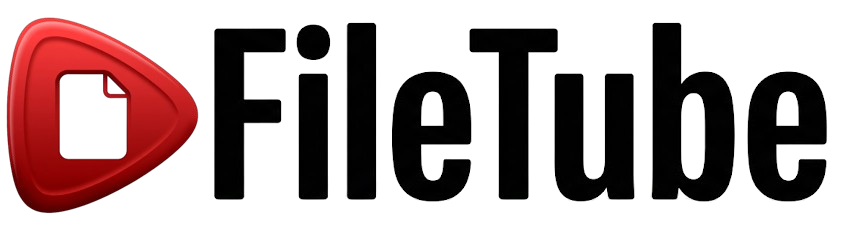
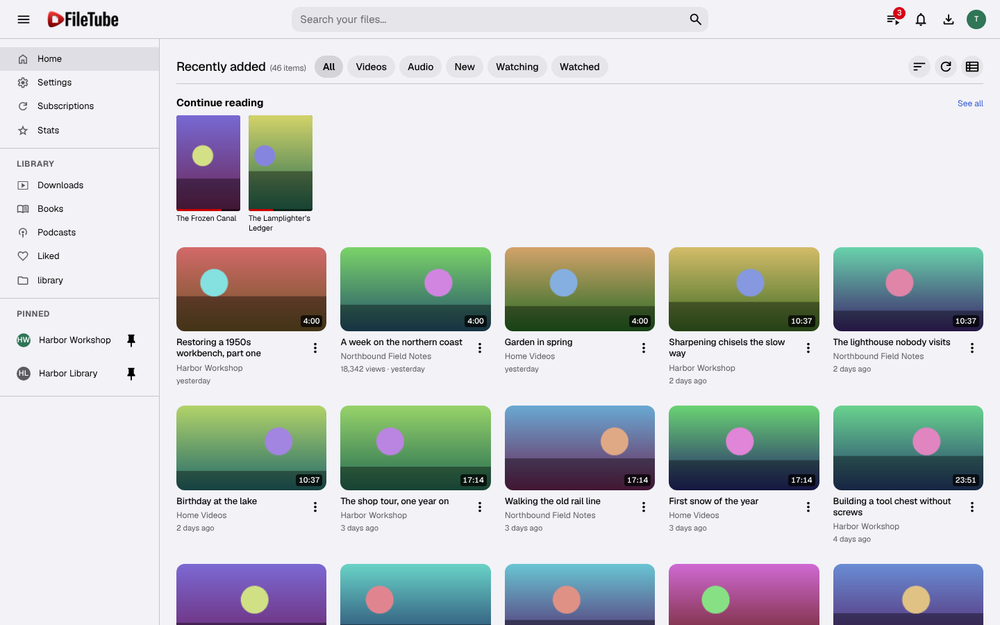
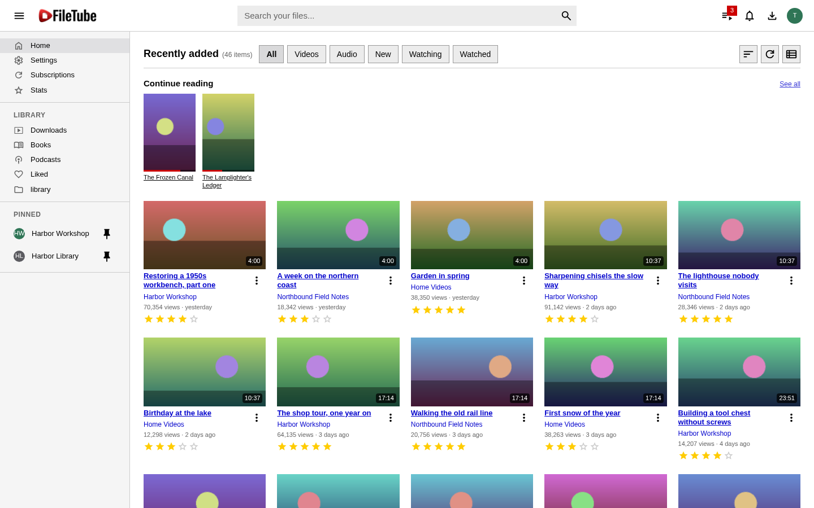
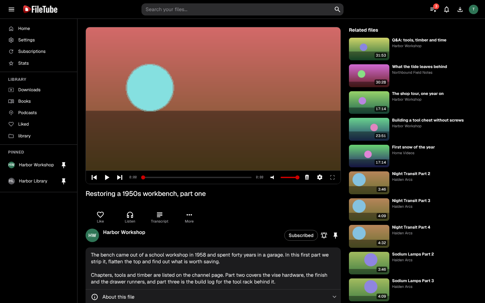
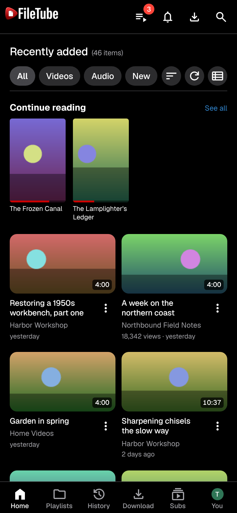
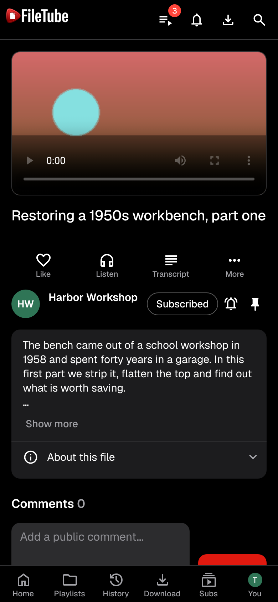
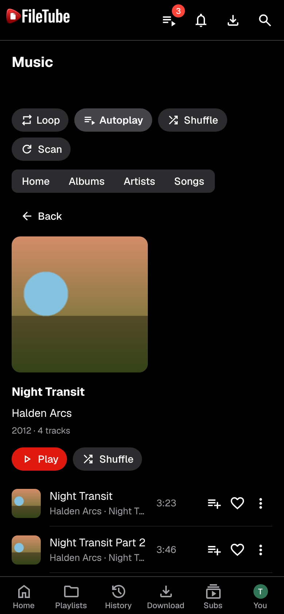
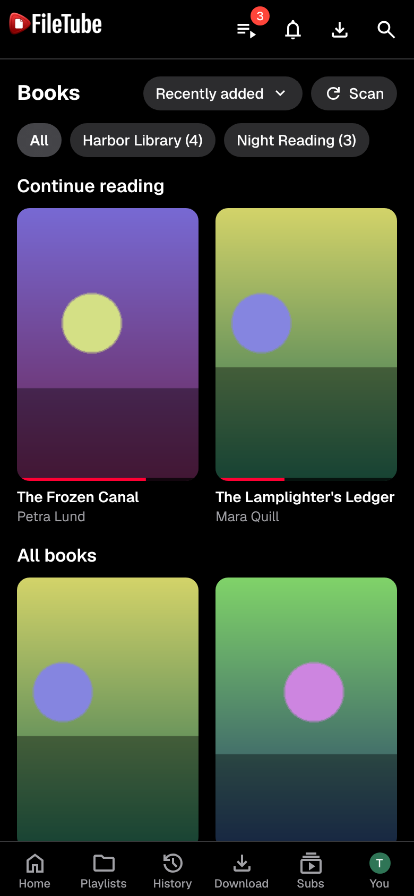
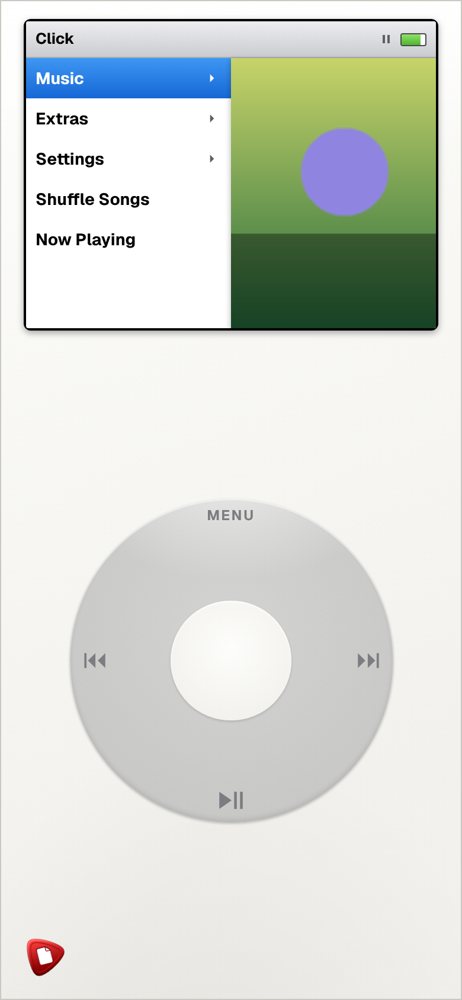

<div align="center">

<picture>
  <source media="(prefers-color-scheme: dark)" srcset="assets/images/filetube-banner-white.png">
  
</picture>

**Broadcast yourself - your files.**

A lightweight, self-hosted media server with a nostalgic, classic-YouTube interface.
Your videos, music, and books - on every screen in the house, and nowhere else.

[](https://github.com/dtammam/filetube/actions/workflows/ci.yml)
[](https://github.com/dtammam/filetube/actions/workflows/docker-publish.yml)
[](https://hub.docker.com/r/deantammam/filetube)
[](https://hub.docker.com/r/deantammam/filetube)
[](LICENSE)

[Quick Start](#quick-start-docker) · [Features](#features) · [Screenshots](#screenshots) · [Roku](#-on-your-tv-the-roku-channel) · [Extension](#-in-your-browser-the-downloader-extension) · [Configuration](docs/CONFIGURATION.md) · [Roadmap](ROADMAP.md)

</div>

---

FileTube scans your local media folders and serves them through a web app that
looks and feels like the YouTube you remember - pick your era (2005, 2009,
2014, or 2021), light or dark. It runs on your own server or LAN with a single
container, streams to desktop, phone (PWA), and Roku, and keeps watch
progress, likes, and reading positions per account, synced across devices.
Your library never leaves your network - the only outbound traffic is what
you explicitly opt into (yt-dlp channel downloads, podcast RSS fetches,
optional downloader-engine updates installed from PyPI at runtime - off by
default, bundled engine otherwise, see the
[configuration guide](docs/CONFIGURATION.md#keeping-yt-dlp-up-to-date) - and
Web Push notifications).

## Screenshots

**Desktop - the 2021 era in light mode, then the 2005 era and the watch page:**

<p align="center">
  
</p>

<p align="center">
  
  &nbsp;
  
</p>

**Phone - the installed PWA, dark mode:**

<p align="center">
  
  &nbsp;
  
  &nbsp;
  
  &nbsp;
  
  &nbsp;
  
</p>

The screenshots use a synthetic demo library, not real media.

## Features

### Watch

- **Classic YouTube experience** - grid home, uploader channels, star ratings, mock comments, and four era themes (2005 / 2009 / 2014 / 2021) with matching icon sets, plus light/dark mode.
- **A real player, not a `<video>` tag** - app-owned blocky controls, keyboard shortcuts (J/K/L, 0–9, speed, loop, and more), press-and-hold 2×, chapters, and inline playback on iOS.
- **Keep browsing while you watch** - the player docks to a mini-player as you navigate; theatre mode, Picture-in-Picture, prev/next, and optional autoplay.
- **Smart resume, synced everywhere** - progress saves continuously and follows you across desktop, phone, and TV.
- **Watch later and Share** - a per-account Watch later list that empties itself as you finish things, and a Share button on downloads from any site.
- **Plays what browsers won't** - AVI, HEVC, VP9, AC-3 and friends transcode on demand to H.264/AAC MP4, so everything plays on an iPhone too.

### Listen & read

- **First-class music library** - Albums / Artists / Songs / Liked with album art, shuffle, search and sort, and an art-forward phone-first now-playing view. ALAC transcodes on demand.
- **The Pocket, with skins** - a phone-first music player you can dress as an iPod (Click or Original, in dozens of real colourways) or one of the modern players (Cider, Nordic); pick a skin from Settings or from inside the Pocket's own menu.
- **Downloaded music channels in the Music library** (optional, off by default) - if you download MP3s from music channels (game-music remixes, album mixes, and the like), turn this on to have them appear in the Music library too - grouped by channel, played through the music mini-player - without duplicating anything or removing them from your feed. Channels whose uploads are tagged "Music" appear automatically; a per-channel "♪" toggle includes the ones YouTube tags differently. Turn it on in Settings; it's per-account.
- **Books library + reader** - EPUB and PDF in the browser: paginated reader, table of contents, paper/sepia/night themes, per-account positions.
- **"Listen from Here" (TTS)** - have book chapters read aloud (lock-screen friendly); works out of the box, upgradeable to a natural [Piper](https://github.com/OHF-Voice/piper1-gpl) voice.
- **Podcasts, self-hosted** - subscribe to RSS feeds (private/paid feed URLs stay in a secrets file outside the database), auto-download new episodes for offline playback, with show art, per-user progress/played state, pins, and a recoverable trash - background playback and lock-screen controls included.

### Speakers and links

- **Play music on another computer from your phone** - turn on Remote control on a computer's Music page, then pick it under Speakers on your phone. Both have to be signed in to the same account.
- **A speaker computer that opens ready** - bookmark `https://<your FileTube>/music?remote=on` on the computer wired to your speakers (or launch it in kiosk mode). It opens with Remote control on and shows up under Speakers. It works on Home, Music, Podcasts, TV, Books, History, Stats and a watch page (not Settings), and the address bar drops the `?remote=on`. On a phone the link does nothing: a phone controls, it is never a speaker. If the computer is signed out, it signs in and comes back to the same page. A sign-in that is used at least every couple of weeks stays signed in. It renews for 180 days after you last typed your password, and the last renewal lasts up to 30 days more.
- **The one click** - a browser won't start sound on a page nobody has clicked or typed in since it opened. Until someone does (or the computer starts playing anyway), your phone says "Click the PC's tab once to let it play" and the computer asks for a click. Click anywhere on that tab once and every song after that plays. To skip the click on a dedicated speaker machine:
  - Chrome, Chromium or Edge: launch with `--autoplay-policy=no-user-gesture-required` (for example `--kiosk --autoplay-policy=no-user-gesture-required https://<your FileTube>/music?remote=on`), or allow your FileTube address in the `AutoplayAllowlist` policy.
  - Firefox: Site settings > Autoplay > Allow Audio and Video for your FileTube address.
  - Safari: Settings for this website > Auto-Play > Allow All Auto-Play.
- **The computer's volume from your phone** - while your phone controls a speaker computer, tap the time at either end of the bar on Now Playing (or pick Speakers > Volume): the iPod's volume bar takes the bar's place and the wheel turns the computer's music up or down, the way an iPod did. It goes back by itself after two seconds, or press MENU. Cider and Nordic show a volume row under the bar instead. This is FileTube's own player volume on that computer, not its system volume, and your phone's own volume buttons still change only the phone (a web page can't use them). A muted computer shows an empty bar; turning up un-mutes it. If that computer's tab was muted and nobody has clicked it yet, un-muting stops the music (a browser rule) and your phone asks for the one click. An iPhone or iPad used as the speaker has no volume bar (iOS doesn't let a page set it).
- **Links you can bookmark**
  - A video at a moment: `/watch.html?v=<id>&t=1m30s` (or `&t=90`). It starts there even if you had watched further.
  - Music: `/music?artist=<name>`, `/music?artist=<name>&album=<title>`, and `/music?playlist=liked` (or `recent-played`, `recent-added`). Add `&mode=play` to play the list or `&mode=shuffle` to shuffle it. `/music?mode=shuffle` shuffles your whole library. An album or artist page has a Copy link button.
  - These combine with the speaker link: `/music?remote=on&playlist=liked&mode=shuffle`.
- **App-icon shortcuts** - an installed FileTube offers Music, Now Playing, Shuffle Songs and Podcasts when you long-press its icon on Android, or right-click it in the dock or taskbar with desktop Chrome or Edge (Safari on a Mac, 17.4 and later). iPhone and iPad home-screen apps don't support shortcuts (MDN browser compatibility data lists iOS Safari as unsupported), so nothing shows there. An app that's already installed may need a reinstall before the shortcuts appear.

### Run your library

- **Multi-account** - an auth wall with per-user progress, likes, pins, and reading positions; admin user management; **per-user library access control** (block-list or a fail-closed allow-list for a kid-safe account - scoped across video, music, podcasts, and books, on both listings and direct file access); one-click app-state backup/restore (settings, accounts, watch state, library metadata - your media files themselves stay wherever you keep them and are not in the bundle).
- **Auto-scan with safe pruning** - rescans on an interval; removes entries only for files that are truly gone (an unmounted share is never treated as a deletion).
- **Auto thumbnails** - FFmpeg extracts video frames and audio cover art; caches are size-capped and age-swept.
- **Optional YouTube subscriptions (yt-dlp)** - off by default. Subscribe to channels, auto-download new videos into your library, with per-channel quality/length/Shorts controls and one-shot URL downloads. [Full guide →](docs/CONFIGURATION.md#optional-youtube-subscriptions-yt-dlp)
- **PWA install** - add it to your phone or desktop home screen like a native app.

## 📺 On your TV: the Roku channel

FileTube ships a native, sideloadable [Roku channel](roku/README.md): sign in
once, browse your library as a poster grid with search, library and channel
pickers (with avatars), and play with resume, captions, chapters, loop, and
autoplay - watch progress syncs with the web app both ways. The server
transparently fixes Roku-hostile files (embedded thumbnail tracks, rotated
phone videos) with cache-only renditions that never touch your originals.
The channel is video-first: music, books, and podcasts live on the web app
and PWA, not (yet) on the TV.
Setup and deploy: [roku/README.md](roku/README.md).

## 🧩 In your browser: the downloader extension

FileTube ships a sideloadable [Chromium browser extension](extension/) - a
Manifest V3 dev/unpacked add-on (Chrome, Edge, Brave, and other Chromium-based
browsers), validated and confirmed working. From any tab it offers a one-tap
**Audio** or **Video** download of the current page into your library: it POSTs
the tab URL to your instance's existing yt-dlp download endpoint, authenticated
with an API token held only inside the extension's background worker. The popup
recognizes well-known yt-dlp sites (YouTube, Vimeo, SoundCloud, Twitch, TikTok,
and ~1800 more) as a positive hint - it never gates, so the server makes the
final call. Like the Roku channel, it is a companion surface: load it unpacked
in your browser rather than from a store.
Setup and load: [extension/](extension/).

## Quick Start (Docker)

You'll need **Docker** with **Docker Compose**.

```bash
git clone https://github.com/dtammam/filetube.git
cd filetube
cp .env.example .env
```

Open `.env` and set the basics:

| Variable | What to put | Why |
|----------|------------|-----|
| `FILETUBE_IMAGE_TAG` | `latest` or a pinned version | Which container image to run |
| `SERVER_HOST_PORT` | e.g. `3000` | The port you'll browse to |
| `DATA_DIR` | e.g. `./data` | Database, thumbnails, art, caches |

Mount your media in `docker-compose.yml`:

```yaml
    volumes:
      - ./data:/app/data
      - /path/to/your/movies:/media/movies
      - /path/to/your/music:/media/music
```

Start it:

```bash
docker compose pull && docker compose up -d
```

Open [http://localhost:3000](http://localhost:3000). The first boot walks you
through creating the admin account; then open **Settings**, add your container
paths (e.g. `/media/movies`), and hit **Save & Scan Library**. Books and music
get their **own** folder boxes in Settings (the three sets must not overlap).

### Staying up to date

| `FILETUBE_IMAGE_TAG` | Behavior |
|-----|----------|
| `latest` | Newest **release** (recommended) |
| `1.4.2` | Pinned exactly - never moves |
| `1.4` / `1` | Latest within that line |
| `edge` | Newest `main` commit |

```bash
docker compose pull && docker compose up -d
```

Prefer automatic updates? Point [Watchtower](https://containrrr.dev/watchtower/)
at `latest`. Full tag scheme: [docs/RELEASING.md](docs/RELEASING.md).

## Configuration

Everything beyond the basics - accounts and admin recovery, automation and
cache tuning, transcode/Roku cache env vars, the SQLite database and
migration notes, YouTube subscriptions, cookies for members-only content,
and text-to-speech - lives in the
**[configuration reference](docs/CONFIGURATION.md)**. The defaults are sane;
you can run FileTube without reading it.

## Local development (without Docker)

- Node.js **v22.13+** (SQLite via the `node:sqlite` builtin)
- FFmpeg on your PATH (optional; needed for thumbnails/transcoding)

```bash
npm install
npm start        # http://localhost:3000  (PORT=3001 npm start to override)
npm test         # the full suite
```

Architecture and contribution notes: [docs/ARCHITECTURE.md](docs/ARCHITECTURE.md) · [docs/CONTRIBUTING.md](docs/CONTRIBUTING.md)

## Roadmap

Planned work and honest release notes (including what code review caught) live in [ROADMAP.md](ROADMAP.md).

## License

[MIT](LICENSE) © Dean Tammam
