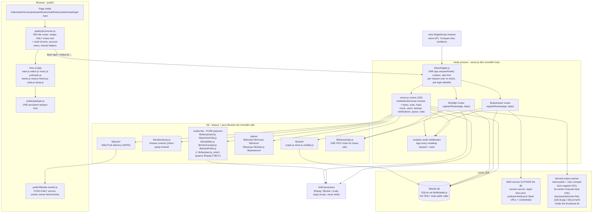
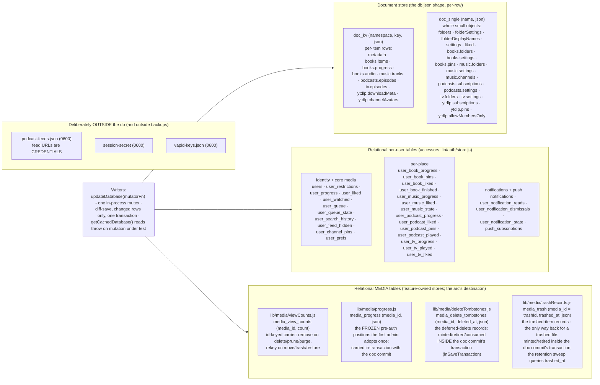
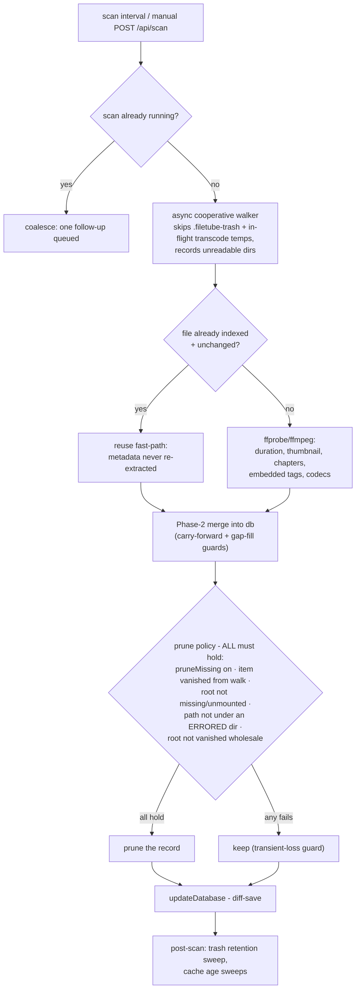
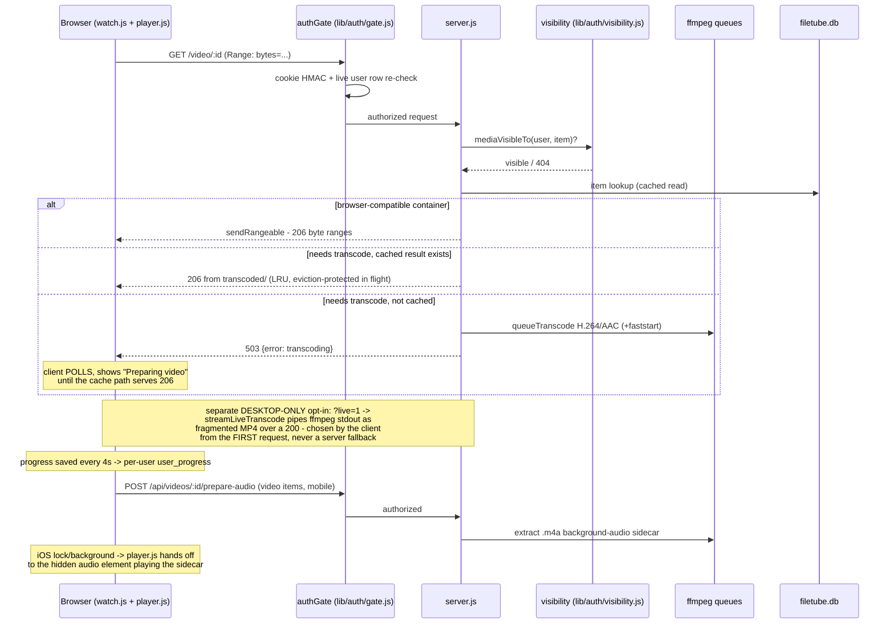
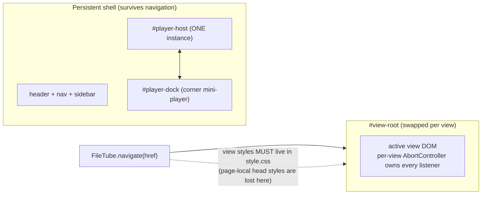
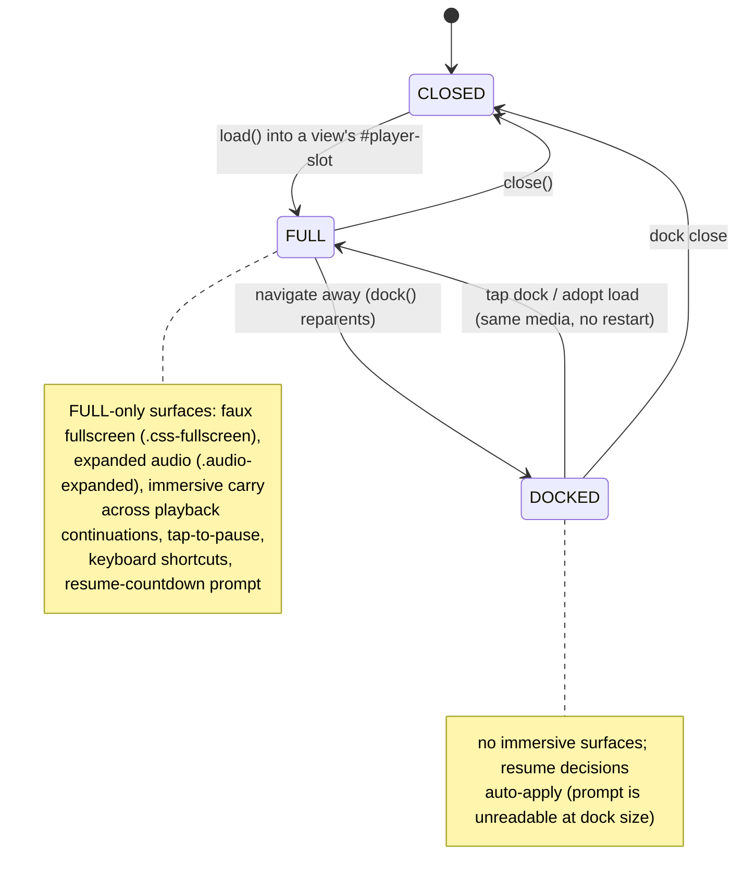

# FileTube Architecture Diagrams

Visual companion to `docs/ARCHITECTURE.md` (the prose reference) - five
diagrams: the module map, the data model, the scan pipeline, the
watch/stream flow, and the client SPA + player lifecycle. Mermaid, rendered
natively by GitHub.

Facts here are MACHINE-DERIVED and checker-bound:
`test/unit/docs-diagrams-census.test.js` verifies every repo path named in
this file exists, every persisted namespace and relational table appears in
the data-model section, and the headline counts match a live derivation -
so a rename or a new namespace turns this document red instead of letting
it lie. When this document and the code disagree, the code wins and this
file is the bug.

## 1. Module map

One process. Every request passes the auth gate; two subsystems own their
route surface via `registerRoutes(app, deps)`; everything else is a library
the monolith calls. Route counts measured at v1.135.0: 135 registrations in
`server.js`, 67 across `lib/podcasts/` + `lib/ytdlp/`.

## 2. Data model

One SQLite file, two buckets (see ARCHITECTURE.md "Storage"). The document
store persists the legacy db.json object shape per row; everything
user-scoped is relational, and so are the media namespaces the
relational-migration arc has moved out of the document store so far (the
view counter in Wave 1; the frozen pre-auth positions and the deferred-delete
tombstones in Wave 2; the trashed-item records in Wave 3 - see the MEDIA box).
The namespace lists in `lib/db/sqlite.js` are a
LOCK (`assertNoUnknownKeys()` throws on strangers). Measured at v1.293.0:
9 `doc_kv` namespaces, 18 `doc_single` names, 34 relational tables,
schema version 23. (The relational-migration arc, Wave 1 onward, moves the
media namespaces out of the document store one table at a time - see
`docs/exec-plans/active/2026-09-13-sqlite-relational-migration.md`.)

Ownership at a glance: `metadata`/`folders*` belong to the video core in
`server.js`; `media_view_counts` to `lib/media/viewCounts.js` (Wave 1 of the
relational arc - the first media namespace out of the document model),
`media_progress` to `lib/media/progress.js`, `media_delete_tombstones` to
`lib/media/deleteTombstones.js` (Wave 2) and `media_trash` to
`lib/media/trashRecords.js` (Wave 3) - id-keyed JSON-record stores on the
shared `lib/media/jsonRowStore.js` shape; writes that must be atomic with a
doc commit ride `updateDatabase`'s `inSaveTransaction` hook. Each store is
its table's only runtime writer, and the adapter holds the bulk seams: the
legacy-JSON import, the one-shot v21/v22/v23 backfills, and the restore/reset
wipe-and-replace; `books.*` to `lib/books/`; `music.*` to
`lib/music/`; `podcasts.*` to `lib/podcasts/`; `ytdlp.*` to `lib/ytdlp/` -
feature-owned namespaces are what keep the persist-gate bug class away.

## 3. The scan pipeline

One interval drives media + books + music scans and the trash sweep.
`id = md5(filePath)` (path-derived - every move/relocate has an explicit
re-key lane).

## 4. The watch/stream flow

Every byte passes the same gate as every page. Browser-incompatible
containers transcode on demand; iOS background audio rides a pre-extracted
`.m4a` sidecar.

## 5. The client SPA + the persistent player

The router swaps ONLY `#view-root`; header, nav, and the player host never
remount. The player is ONE host element reparented between states - the
battle-won subsystems (background-audio handoff, caption overlay, faux
fullscreen, immersive carry) live on it and are reused, never rebuilt.

## Reading order

New to the codebase: diagram 1 for the shape, then `docs/ARCHITECTURE.md`
top to bottom, then diagram 2 next to the "Storage" section. Debugging a
playback issue: diagrams 4 and 5, then the player.js header comments.
Adding a persisted field: diagram 2, then the namespace LOCK in
`lib/db/sqlite.js`, then ARCHITECTURE.md "Storage" - and remember the
schema-version rules in `docs/RELEASING.md`.
